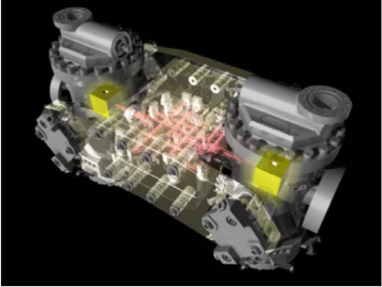
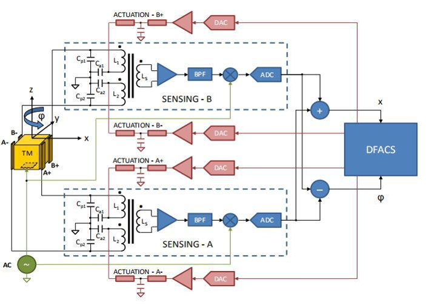
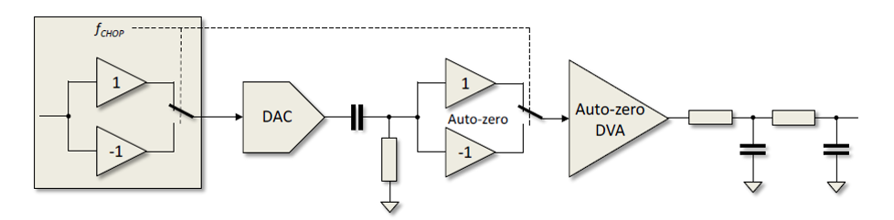
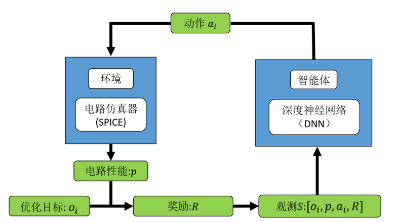

# National Key Research and Development Programme: Research on control methods and technologies for inertial sensors

### **[[Research on Control Methods and Technologies for Inertial Sensors and Tianqin Centre](https://tianqin.sysu.edu.cn/) ]**  
The head of project Research on Control Methods and Technologies for Inertial Sensors: Supervisor [Jiwe Zhang](https://cmee.nefu.edu.cn/info/1074/3442.htm), participants [Yonghao Xie](https://github.io/xieyonghao)   

I am responsible for the development of transfer functions and noise equivalent models for the key units of the AC feedback actuation system, then determine the noise sources of the AC feedback actuator system and complete the noise index allocation according to the project requirement index, establish AC feedback actuator noise theory analysis and experimental research.

## Introduction
<!-- 

  <big><b>Research Content Structure</b></big>

  ****→****

After forming the theoretical model, the hardware structure and optimisation algorithms are used to improve the noise in the time-sharing control mode and the frequency-sharing control mode.

Hardware is employed with integral feedback, correlated multisampling and modulation and demodulation.

  

The optimization algorithm mainly uses reinforcement learning methods to optimize circuit parameters to achieve optimal circuit parameters, thus reducing circuit noise and achieving voltage noise within 10uV/Hz-1/2- in the low frequency band.   

  

## Acknowledgement

Thank you for the support of the National Key Technologies Research and Development Program of China.

## Contact

Jiawei Zhang(zjw@nefu.edu.cn)
