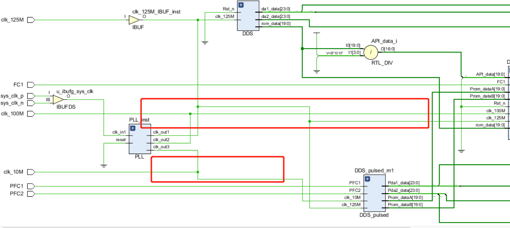
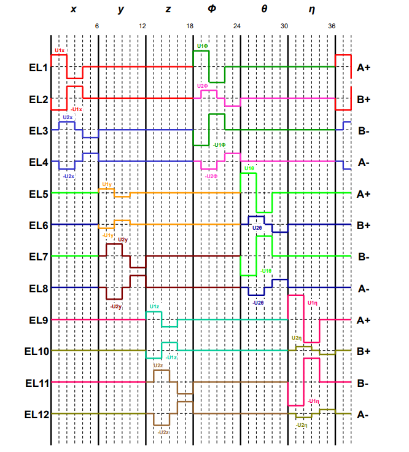

# FPGA control in Research on control methods and technologies for inertial sensors

### **[[Research on Control Methods and Technologies for Inertial Sensors and Tianqin Centre](https://tianqin.sysu.edu.cn/) ]**  
The head of project Research on Control Methods and Technologies for Inertial Sensors: Supervisor [Jiwe Zhang](https://cmee.nefu.edu.cn/info/1074/3442.htm), participants [Yonghao Xie](https://github.io/xieyonghao)   

The control signal is generated in the FPGA, and the control signal is modulated forming a high frequency modulation modulation signal, which is passed through the DAC circuit forming an analogue voltage, then through the low-pass recorder circuit, filtering out low frequency noise, and demodulated by the analogue circuit obtaining the control signal.

## Introduction

  <big><b>Study structure diagram</b></big>

  

After forming the digitally modulated signals, After DAC circuitry, the analogue voltage is obtained.

  

After high pass filter, low frequency noise is filtered out.

  

After analog chopper switching, a low-noise analog voltage quantity is obtained

## Acknowledgement

Thank you for the support of the National Key Technologies Research and Development Program of China.

## Contact

Yonghao Xie(2020111721@nefu.edu.cn)
